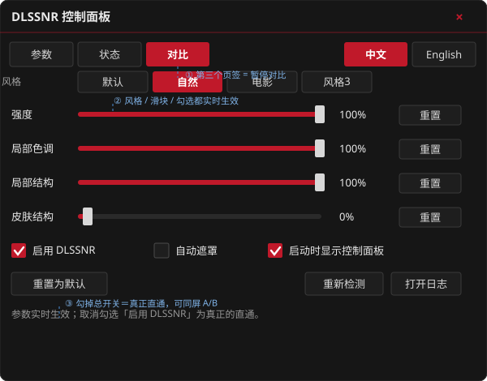
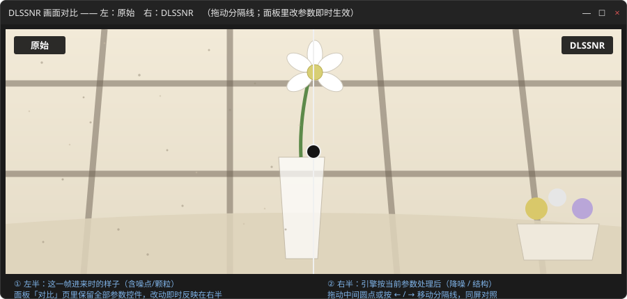

# dlssnr-filter

**一个 DirectShow 滤镜，把 NVIDIA 的神经渲染网络（DLSS "NR"）接进任意播放器，
边看边调参数。**

在 PotPlayer / MPC-BE / MPC-HC 里挂上它，播放的视频会逐帧经过神经降噪 / 去块 / 细节重建；
配一个实时控制面板，能在播放中用滑块调强度、局部色调、局部结构、皮肤结构和自动遮罩，**改完立刻生效，不用重启播放器**。

- 🎬 **即插即用** —— 挂进播放器就能用，不需要写脚本、不需要转码
- 🎚️ **实时调参** —— 共享内存通道，播放中拖动滑块即时生效
- 🔍 **状态可见** —— 面板显示心跳、帧计数、每帧耗时，以及"为什么现在没在处理"的人话原因
- 🧯 **绝不破坏播放** —— 引擎缺失、初始化失败、尺寸不支持，一律**降级为直通**，播放器不会崩
- 📦 **零第三方依赖** —— 只链接 `ole32` / `ADVAPI32` / `KERNEL32`，不需要 ATL、不需要 NVIDIA SDK

---

## 它需要什么

```
app\dlssnr_dshow.dll     ← 本仓库编译产物（含托盘图标 + 控制面板）
app\dlssnr_dshow.ini     ← 配置
app\dlssnr_host2.dll     ← ★ 引擎宿主，需要另外获取（见下）
app\nvngx_dlssnr.dll     ← ★ NVIDIA 运行库，需要自行准备
```

后两个文件**本仓库不提供**：

| 文件 | 从哪来 |
|---|---|
| `dlssnr_host2.dll` | 我们自己的代码（MIT）。从 **[dlssnr-toolkit](https://github.com/CyanKe/dlssnr-toolkit)** 的 Release 下载，或自行编译 |
| `nvngx_dlssnr.dll` | NVIDIA 的 DLSS「NR」网络。**没有官方公开下载渠道**，本项目开发所用是社区构建版；请自行取得 |

> ⚠️ **本仓库不含、也**不得**再分发任何 NVIDIA 二进制。**
> 详见 [`docs/THIRD_PARTY.md`](docs/THIRD_PARTY.md)。

**缺少引擎时滤镜照常工作** —— 它只是逐帧直通，播放器完全不受影响。日志会说明原因。

---

## 安装

### 1. 编译

需要 Visual Studio 2022（C++ 工作负载），**不需要任何 NVIDIA SDK**：

```
tools\build.bat
```

产物是 `app\dlssnr_dshow.dll`。

### 2. 放置引擎

把 `dlssnr_host2.dll`（来自 dlssnr-toolkit）和 `nvngx_dlssnr.dll`
放到**与 `dlssnr_dshow.dll` 同一目录**（即 `app\`）。

### 3. 注册（需管理员）

```
tools\register_filter.bat
```

反注册：`tools\register_filter.bat /u`

### 4. 挂进播放器

以 **MPC-BE** 为例：`选项 → 扩展滤镜 → 添加滤镜` 选 `app\dlssnr_dshow.dll`，设为 **首选**。

以 **PotPlayer** 为例：`选项 → 滤镜 → 滤镜管理器 → 添加外部滤镜`，选同一个 DLL，设为 **强制使用**。

> 滤镜注册为 `MERIT_DO_NOT_USE`，**不会被任何播放器自动插入** —— 这是故意的。
> 否则它会劫持机器上所有 DirectShow 图，包括你不希望被处理的那些。

播放器需要输出 **NV12**（LAV Video Decoder 默认就是），渲染器用 **EVR**。
滤镜同时接受 NV12 / RGB24 / RGB32。

---

## 使用

### 实时调参

界面是**通知区域（托盘）里的一个小图标** —— 和 LAV Filters 的做法一样，直接实现在
滤镜 DLL 内部：**不需要 Python，也不多开进程**。

播放视频时图标自动出现，停止播放自动消失：

| 操作 | 效果 |
| --- | --- |
| **右键图标** | 快速菜单：启用 / 风格 / 强度 / 局部色调 / 局部结构 / 皮肤结构 / 自动遮罩 / 打开控制面板 / 打开日志 / 关于 / 隐藏图标 |
| **双击图标** | 打开控制面板（深色紧凑界面，带**滑块**，可连续调参，实时生效） |
| **播放器内** | 滤镜 → DLSSNR → 属性，打开同一个控制面板 |

控制面板布局（深色自绘界面）：



- **无边框窗口 + 自带标题栏** —— 不再用 Windows 经典标题栏/边框：顶部是深色标题条（左边面板名、右边红色 ×），拖标题条移动窗口，`Alt+F4` 或 × 关闭；作为托盘工具不进任务栏（Windows 11 下为圆角窗口）
- **三个标签页** —— `参数` / `状态` / **`对比`**；右上角 `中文` / `English` 直接切换界面语言，窗口尺寸不随之变化（对比窗口的标题与标签也跟着切换）
- **一行一个参数** —— 左侧名称、中间细轨道条（左侧填充为红色）、右侧百分比读数和自己的 `重置` 按钮，重置只影响该行
- **参数页底部** —— 一行复选框（启用 DLSSNR / 自动遮罩 / 启动时显示控制面板），以及 `重置为默认` / `重新检测` / `打开日志`
- **状态页** —— 引擎状态（绿/黄/红）、PID、帧统计、视频与引擎会话尺寸
- **对比页** —— 保留**全部参数控件**（拖动滑块、换风格、勾选总开关都在这一页），同时打开「对比窗口」（见下）


控制面板行为：

- **单实例** —— 关掉只是隐藏，从托盘随时能找回**同一个**窗口
- **暂停不会让它消失** —— 显隐只看滤镜是否还在
- **参数实时生效** —— 拖动滑块立刻作用于下一帧 / 暂停时作用于松手后重新交付的那一帧，同时写回 `dlssnr_dshow.ini`
- **可设启动时自动显示** —— 面板中勾选 "启动时显示控制面板" 后，每个播放会话在引擎就绪时自动打开一次（与托盘右键菜单同一开关）
- **自绘界面随 DPI 缩放** —— 所有尺寸按实际对话框字体测量后换算，字体放大（如 150%/175% 缩放）不会再把中文标签或状态文字截断

> 为什么滑块在窗口里而不是托盘菜单里：Windows 的托盘菜单本质是个 `HMENU`，
> 只能放文字/位图项，**无法容纳可拖动的控件**。madVR 的滑块同样在它的设置窗口里。

### 暂停对比（`对比` 页签）



暂停时**上游一帧都不投递**（实测：`Pause` 之后 6.6 秒里 `frames while paused: 0`），而"当前这一帧"的画面归**播放器**管。
滤镜能走的每条路都实现并实测过，**没有一条能让暂停画面动**：

| 试过的做法 | 实测结果 |
| --- | --- |
| 把重算后的样本**推**给渲染器（`NewSegment` + preroll） | 被接受（`Receive 0x0`）但**只被排队、从不绘制**；一解除暂停，队列里那些"不同风格"的帧一次性喷出 |
| `IMediaSeeking::SetPositions` 重新定位 | 暂停中的解析器只交回**上一个关键帧**：在 8.6 秒处改参数，画面**和播放器进度**一起跳回开头 |
| `IMediaControl::Run()` + **立刻** `Pause()` | 画面毫无变化（转换可能在源交出帧之前就完成了） |
| `IVideoFrameStep::Step(1)`（播放器自己的逐帧步进） | `CanStep 0x0 / Step 0x0`、确实交付了一帧，但 **PotPlayer 连自己的"定位：下一帧"都不刷新暂停画面** |
| `Stop()` + `Pause()` | 结构上可行，但**播放器状态错乱**：之后点播放、拖进度条都不动 |
| 对已暂停的图再调 `Pause()` | **根本传不到滤镜**（实测第二次 `Pause()` 没有发生），无效 |

最后一条是决定性的：冻结帧由播放器持有，**滤镜侧无法取胜**。所以播放器侧**已完全放弃**（滤镜里没有任何
`IMediaControl` / `IMediaSeeking` / `IVideoFrameStep` 调用），改由面板自己做对比：

1. 点面板的 **`对比`** 页签 → 出现一个**独立窗口**，同一帧画两遍：**左＝原始**（进来时的样子）、**右＝DLSSNR 处理后**，
   中间一条**可拖动的分隔线**（圆点可拖，或按 ← / → 微调）——思路同 NVIDIA ICAT 的分屏对比；
2. **不用切页签**：对比页上保留全部参数控件，拖滑块 / 换风格 / 勾掉「启用 DLSSNR」→ 右半**实时**按新参数重算；
3. 对比窗口**不会因为切回其它页而关闭**（要关点它自己的 ×）；关闭后滤镜**一帧都不再复制、也不再重算**（零开销）。

实现要点（都在本仓库内，两边同在一个 DLL 里）：

- 对比窗口打开时，滤镜把每帧镜像进一块**带锁**的缓冲——两张 packed、顶向下 **BGR24** 图（DirectShow 的 `RGB24`
  本身就是 B,G,R，面板可直接 `StretchDIBits`）＋一个序号；
- 参数变化仍由 `DlssNrApply()` 推送通知，滤镜**用新参数重跑留住的那一帧**并递增序号；
- 重算跑在**工作线程**上，并按引擎的**参数版本号**循环到最新一版为止（否则拖滑块时每格都堵 UI 线程 → 卡顿，
  且会渲染出过期参数 → 右侧闪烁）；整段"拷贝 → 引擎 → 回写"都在流锁内（`m_scratchIn/Out` 与实时取帧共用）；
- 对比窗口**双缓冲**绘制（内存 DC + 一次 `BitBlt`），标签按实测文字宽度画深色底片、随语言切换。

> 用法：播放一会儿（让滤镜拿到帧）→ 暂停 → 点 `对比` → 拖分隔线对比 → 在对比页上调参数看右半实时变化。

### 跳转 / 拖动进度条

- 滤镜**不再占用播放器线程等待模型加载**：`Pause()` 和新建滤镜实例只登记请求（不阻塞），
  引擎线程可能正持有锁跑 1-15 秒的模型加载。
- 实现了完整的 **DirectShow flush 协议**：`Stop()`/`BeginFlush()` 之后 `Receive()` 立刻返回 `E_ABORT`，
  并把 flush 转发给下游渲染器；正在跑的那一帧处理完也不会再往下送。
- 结果：拖动时间轴、左右键跳转、切换文件时，播放器不会再卡成 “未响应”。

### 参数

`app\dlssnr_dshow.ini`：

| 键 | 说明 |
| --- | --- |
| `enabled` | 总开关。0 = 真正的直通（逐字节等于输入） |
| `style` | 风格 0-3（默认 / 自然 / 电影 / 风格3） |
| `intensity` | 强度 0-100（%），默认 100 = 1.0。100% 以上引擎不再响应，所以滑块封顶在 100% |
| `localtone` | 局部色调 0-200（%），默认 100 = 1.0 |
| `localstruct` | 局部结构 0-200（%），默认 100 = 1.0 |
| `skinstructure` | 皮肤结构 0-200（%），默认 0 = 关。**需要 `automask=1` 才会有作用** |
| `automask` | 自动遮罩 0/1，默认 0。1 = 让网络自己生成遮罩（帧耗时略增，皮肤结构强度依赖它） |
| `autoshow` | 开始播放时是否自动打开控制面板（也可在控制面板或托盘右键菜单里切换） |

四个强度都是**引擎自己单位**的百分比：`100% = 1.0`（开发时一直用的"满格"值，也是重置回去的默认值），
`200% = 2.0`，即 Magpie 界面上 `0–2` 的滑块顶端。存储的是百分数、换算固定为 `pct/100`，
所以旧配置里的 `100` 含义不变。**滑块范围按参数分别定**（下面有实测依据）：
`强度` 0–100%，`局部色调` / `局部结构` / `皮肤结构` 0–200%。

面板里改的会实时生效；拖动结束或切换选项时写回 `dlssnr_dshow.ini`，下次启动读取。

#### `100%` 和 `200%` 实测有差别吗

在真实片源上量过（Chainsaw Man 剧场版抽 3 帧，1280×720，BGR24 直进直出，同一帧只改一个参数，
先 `reset` 一次再取稳态帧；同参数重复跑两次差异为 0，说明整条链是确定性的）：

| 参数 | `1.0` vs `2.0`（100% vs 200%） | 结论 |
| --- | --- | --- |
| NR 强度 | **逐字节完全相同**（3 帧 × 创建前/创建后设置都一样） | DLL 把 `DLSSNR.Intensity` 上限定在 1.0，**100% 以上是死区** |
| 局部色调强度 | 平均 1.1–2.4 灰阶，最大 41，8–38% 像素变化 >2 级 | **有效**，幅度与 `0→1` 同量级 |
| 局部结构强度 | 平均 1.0–2.0 灰阶，最大 31，3–31% 像素变化 >2 级 | **有效** |
| 皮肤结构强度 | 自动遮罩**关闭**时 `0→1` 就已逐字节相同；自动遮罩**打开**时 `0→1` 平均 0.3–0.6（最多 2.3% 像素 >2 级），`1→2` 平均 0.4–0.9 | **必须先开「自动遮罩」才有作用**，且幅度小、只影响局部 |

也就是说：0–200% 只对 `localtone` / `localstruct` 是真扩展，所以**只有这两条（和 `skinstructure`）放到了 200%**；
`intensity` 保持 0–100%，因为多出来的那半段是死区，放在界面上只会误导。
`skinstructure` 要配「自动遮罩」一起用，单独拉高基本看不出来。

---

## 性能

实测（RTX 5070 Ti Laptop）：

| 分辨率 | 每帧耗时 | 折算帧率 |
| --- | --- | --- |
| 1920×1440（NV12 链路） | 14.3 ms | ~70 fps |
| 1920×1080 | ~10 ms | ~100 fps |

滤镜要额外做 `NV12 → BGR24 → 引擎 → BGR24 → NV12` 的往返转换，
1080p 下比 Python 直接调用多约 0.6–1.3 ms。

**建议上限 1080p60。** 1440p / 4K 时 GPU 会成为瓶颈（约 84% 占用），
1080p60 给解码和呈现只留约 7 ms 余量。

---

## 实现说明

`dlssnr_dshow.cpp` 是**完全自包含**的：Windows SDK 提供了 `strmbase.lib`
但**没有 `streams.h`**，也没有 ATL，所以 `CTransformFilter` 系列用不了。
本滤镜直接实现 `IPin` / `IMemInputPin` / `IBaseFilter`，
只复用系统自带的 `CLSID_MemoryAllocator`。

几个踩过的坑记录在源码注释里，包括：

- **注册必须设置 `REG_PINFLAG_B_OUTPUT`** —— 否则滤镜库里根本没有输出引脚，
  而 `IGraphBuilder` 不读这个标志（它直接问引脚），所以手工搭图测试会全绿、真播放器却全败
- **输出引脚不能缓存媒体类型** —— 播放器会用"断开重连输入引脚"来探测图，
  每次断开都会清掉缓存，播放器随后看到"0 种类型"就放弃，且**从不调用输出引脚的 Connect**
- **必须自建 MemoryAllocator** —— EVR 的分配器在 commit 前 `cbBuffer` 读作 0，`SetProperties` 会失败
- **绝不要伪造分辨率** —— 曾硬编码 1920×1080 兜底，导致图构建器用错误的几何连接

---

## 授权

自有代码采用 **MIT**（见 [`LICENSE`](LICENSE)）。

本仓库**不包含、也不得再分发**任何 NVIDIA 软件。
详见 [`docs/THIRD_PARTY.md`](docs/THIRD_PARTY.md)。

DLSS、RTX Video 是 NVIDIA Corporation 的商标与技术。本项目与 NVIDIA 无隶属关系，亦未获其背书。
